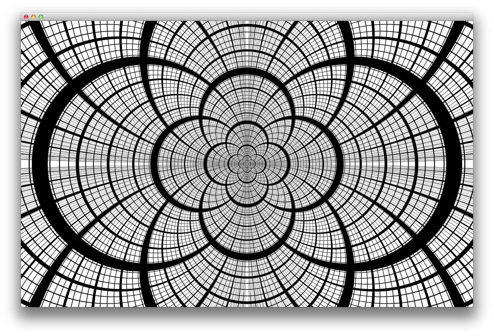

Apollonian-Circles
==================

Draws a set of tangential circles similar to a Smith Chart (just because it looks cool) . More info at http://en.wikipedia.org/wiki/Smith_chart and http://en.wikipedia.org/wiki/Apollonian_circles

The code also includes a print function that is activated by typing 'p'. This renders it a printer resolution.

